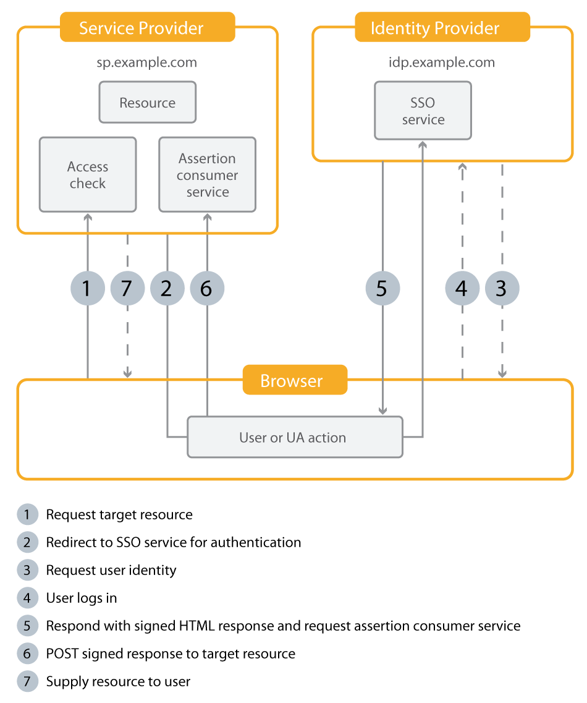

import ExternalCustomerId from './_external-customer-id.md'
import ImplementationOverview from './_implementation-overview.md'

# SAML 2.0

## Implementation Overview

<ImplementationOverview />

## Resources

- [**Definition of Terms**](https://sites.google.com/ieinfo.org/knowledgebase/definition-of-terms)

## SAML 2.0 Flow Diagram



## Configuration

In many cases the SAML 2.0 configuration in TI requires only a few key pieces of information to set up basic authentication. The IdP may require more in-depth configuration in order to meet the needs of your integration (e.g. Attribute mappings, encrypted assertions, etc.). Because this configuration can differ from IdP to IdP, we are unable to provide generic instructions here. You will need to refer to your IdP documentation for advanced configuration.

### 1. Configuring the SP

The following settings should be retrieved from your IdP, and can often be found in the administration console (if applicable) or extracted from the IdP metadata XML of your provider. Please provide the following IdP configuration details to your IE representative so they can add configure the SP.

- **The IdP metadata XML file**: Which contains the following required values

  - **IdP Single Sign-on URL:** TI supports SP-initiated SSO using the HTTP-REDIRECT binding.

  - **IdP Single Logout URL:** Single logout is not currently supported, but you may still enter this value here for future use.

  - **IdP X.509 Certificate:** The public key certificate from the IdP. This is required for security purposes in order to validate authentication requests. The X.509 Certificate should be entered in PEM format with a header. It should start with `-----BEGIN CERTIFICATE-----`. If it does not, you can format the X.509 certificate with an [external tool](https://www.google.com/url?q=https%3A%2F%2Fwww.samltool.com%2Fformat_x509cert.php&sa=D&sntz=1&usg=AOvVaw2llkiiXrZxM4HQ2nycyTzQ).

- **Advanced Settings:** There are several advanced options available, which depend on the support from your IdP. Check with your provider to determine if any of these options are required or desirable.

If you have access to your instance settings (rare), options are configurable under the SAML 2.0 section under Single Sign-on.

### 2. Configuring the IdP

Once the settings have been added to your instance, you will also need to register the SP with your IdP. This process is different for each provider, but generally you will need the following information which can be obtained for your IE representative.

- **The SP metadata XML file:** Which contains the following required values

  - **Assertion Consumer Service (ACS) URL (also called the Single Sign-on URL):** The endpoint that receives HTTP-POST bindings from the IdP. The ACS URL can be found within the TI SP Metadata. If you have to type it in manually, it will be: `https://<school domain>/access/saml/consumer` or `https://<school domain>/access/saml/consumer/client-slug`

  - **Entity Id:** unique identifier for your TI instance SP. The Entity Id can be found within the TI SP Metadata. If you have to type it in manually, it will be `https://<school domain>/access/saml/metadata` or `https://<school domain>/access/saml/metadata/client-slug`

  - **X.509 Certificate:** TI's public certificate for signing and encryption. This certificate can be found within the TI SP Metadata. If you have to type it in manually, see the appendix of this article.

If you have access to your instance settings (rare), they can be obtained from the SSO Settings page by clicking "Download SP Metadata".

### 3. Configuring the Claims & Attributes

We support the following attributes that can be mapped from your IdP. The attributes returned in the authentication request, as well as the attribute names, will vary depending on the IdP. Check with your IdP to determine the available attributes.

For **licenseIds**, see below for potential solution to configuring licenseIds as a static attribute in your SAML config.

:::note
For learners that should be associated with a client (almost every case), you must include one or more licenseIds in the SAML attributes.
:::

- **externalCustomerId** - this comes from the NameID which needs to be unique amongst all learners for all clients in the same instance (see details below)

| Claim | Type | Description | Required? |
| ----- | ---- | ----------- | --------- |
| `NAME_ID` | string | Instance wide unique identifier for the learner | Required |

The following list of TI attributes are available for mapping to any attribute returned from your IdP:

| Attribute | Type | Description | Required? |
| --------- | ---- | ----------- | --------- |
| `firstname` | string | The first name of the learner | Required |
| `lastname` | string | The last name of the learner | Required |
| `email` | string | The email address of the learner | Required |
| `licenseIds` | string | One or more licenses to associate the user with, by ID (required if your setup on as an instance client) | Required |
| `ref1` | string | Data to be associated with the user | Optional |
| `ref2` | string | Data to be associated with the user | Optional |
| `ref3` | string | Data to be associated with the user | Optional |

### 4. User Login

TI supports SP-initiated SSO with SAML, meaning that the login flow begins on the TI platform.

- In order to log a user into the TI instance from an external system, you can create a link to the following path:

  - `https://<product domain>/access/saml/login` or

  - `https://<product domain>/access/saml/login/client-slug`

- It is best practice to set the "External Login URL" SSO Setting to "/access/saml/login" or "/access/saml/login/client-slug" (if you are configuring SSO settings for a Client) in order for users to get directed to the correct sign in page when clicking "Sign in" from within TI.

- Once a user visits this page, they will be redirected to your IdP for authentication. After authentication is successful, the IdP will send the user back to the TI platform with a SAML Response that includes any attributes per the configuration. The user will then be logged into TI and will have access to the content that have been specified in their attributes, if any.

- Also, redirectTo query parameter can be added redirect a learner after authentication

:::note
TI does not support IdP-initiated SSO at this time.
:::

:::note
User Logout: TI supports logging out of the TI platform only. We do not support SAML SLO. If you would like to redirect the user after they are signed out of TI, you can fill in the "Account Logout Link" SSO setting. For example, you could show the user a message saying they are logged out, or the login form should they choose to login again.
:::

## Configuring the NameID (External Customer ID)

<ExternalCustomerId />

## LicenseId as a Static Attribute

This is a potential solution to sending the required licenceId in the SAML payload without needing to adjust user records.

:::note
Adding a static attribute will depend on your configuration. Any examples given here will be generic and may need adjustment for your specific setup. This section in particular is addressed in a SimpleSAMLPhp environment, but hopefully is adaptable to your specific SAML IDP.
:::

The recommended strategy is to use an "Auth Proc Filter" ([documentation here](https://simplesamlphp.org/docs/stable/simplesamlphp-authproc)).

From those docs, modify saml20-sp-remote.php and in the existing 'authproc' => array section (add it missing), add static attributes using the core:AttributeAdd functionality like so:

```php
'authproc' => array(
  // Add STATIC Attributes here...
  30 => array(
    'class' => 'core:AttributeAdd',
    'LICENSE_ID_NAME_HERE' => array('ACTUAL_LICENSE_ID_HERE')
  ),
```

A more comprehensive example might look like:

```php
$metadata['https://example.com'] = array(
  'AssertionConsumerService' => 'https://example.com/',
  'SingleLogoutService' => 'https://example.com/',
  'simplesaml.attributes' => true,
  'attributes' => array('mail', 'givenname', 'sn', 'memberOf'),
  'authproc' => array(
    // Add STATIC Attributes here...
    1 => array(
      'class' => 'core:AttributeAdd',
      'LICENSE_ID_NAME_HERE' => array('ACTUAL_LICENSE_ID_HERE'),
    ),
  )
);
```

## SP X.509 Public Certificate

```
-----BEGIN CERTIFICATE-----
MIIDgzCCAmqgAwIBAgIBADANBgkqhkiG9w0BAQ0FADBbMQswCQYDVQQGEwJ1czEL
MAkGA1UECAwCVVMxGzAZBgNVBAoMElRob3VnaHQgSW5kdXN0cmllczEiMCAGA1UE
AwwZd3d3LnRob3VnaHRpbmR1c3RyaWVzLmNvbTAeFw0xNzA3MTIyMDEyNTBaFw0y
NzA3MTIyMDEyNTBaMFsxCzAJBgNVBAYTAnVzMQswCQYDVQQIDAJVUzEbMBkGA1UE
CgwSVGhvdWdodCBJbmR1c3RyaWVzMSIwIAYDVQQDDBl3d3cudGhvdWdodGluZHVz
dHJpZXMuY29tMIIBIzANBgkqhkiG9w0BAQEFAAOCARAAMIIBCwKCAQIArqB4whkc
URE1DhmsxwBUdY4epWE3KWl6kEmhdtDg1GJo0Bmkt5SU/1Yawja4YvxvR82hpcjk
o+bXJdo3T44Lwq9Y8NQA6DKSZ3duvvx50gUhD3y66ka0AmlayyGDegtHwjz7Px6Q
orRg5aEUMFGGnNZ0AA0+sW0skbfVZsJ+wV5EU8VsXmgqL8mhH8squWXZCOCY+/8M
KW7f1Lf7qBrERRLmVZpgQklx7v8/hxU8K9CMQJR95YG5rLYQjBm1oseaMZmYp2pK
5bKyJCuKiu7nF2eYSnxIAZZKA7Xw1gZRYvnOGguip0yvyHuZMCRmLdg8Fl6Yi4/h
5C1Z/asj1e459/ECAwEAAaNQME4wHQYDVR0OBBYEFNkdMQ/bCwVR0dtyrohqCtZ3
XhmTMB8GA1UdIwQYMBaAFNkdMQ/bCwVR0dtyrohqCtZ3XhmTMAwGA1UdEwQFMAMB
Af8wDQYJKoZIhvcNAQENBQADggECAD4J7tQHK/pkoO5KNrMz/K/rN36cCJ+AP6eK
2Y/WmtC/0WsRuw7DQSTXNLo6CDVi0N8drzF0X9TfpU9LKqIqMNJ8GahyRjNjjHGC
13ET39V/rKUIU4KgiP6MyB5Oqus0u49lpeEPBokUVegH+VLFSxUzWwvVQD9D4j1g
vgYRS9fWAcEihtYUdJyZlOpAQenIw4POrZozk528LEoAupRPjkR6JcqbjoVWeAn7
R+jis+59pbyZJTtmnJFVagyJmqwEE171yU86Eo4TpBmXXwN/fdJA3qr+UKPHgALH
Lfu/UBsugSE3wb5o7BUD1T1xqf1t7JKkuKMKjFxTJm13vC+C4yGc
-----END CERTIFICATE-----
```
